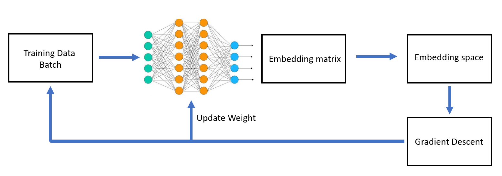
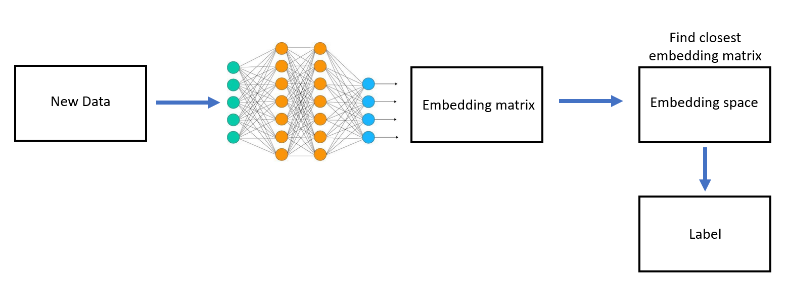

# MNIST Triplet Loss Classification

## Introduction

This project involves classifying images from the MNIST dataset using a custom neural network model with triplet loss. The MNIST dataset consists of grayscale images of handwritten digits from 0 to 9, and this project aims to utilize deep learning techniques to accurately classify these digits.

## Workflow

1. **Data Loading and Preprocessing**:
   - The MNIST dataset is loaded using `fetch_openml` from `sklearn.datasets`.
   - The data is split into training and testing sets using `train_test_split`.
   - The features are normalized using `StandardScaler`.

2. **Model Definition**:
   - A neural network class (`NeuralNetwork`) is defined with an input layer, one hidden layer, and an output layer.
   - The network uses the `tanh` activation function for the hidden layer.

3. **Training Process**:
   - **Triplet Generation**: Triplets of anchor, positive, and negative samples are generated using the `create_triplets` method.
   - **Forward Pass**: The network performs a forward pass to compute embeddings for the anchor, positive, and negative samples.
   - **Loss Calculation**: The triplet loss is computed to measure how well the model is learning to differentiate between similar and dissimilar samples.
   - **Backward Pass**: The gradients are computed and weights are updated based on the computed loss.

4. **Evaluation**:
   - **Embedding Generation**: The model generates embeddings for both training and test data.
   - **Prediction**: The nearest neighbors in the embedding space are found using cosine distance to classify test samples.
   - **Accuracy Calculation**: The accuracy of the model on the test set is computed using `accuracy_score`.

### Backward

### Forward 

## Mathematical Formulas

### Tanh Activation Function

The `tanh` activation function is defined as:

$$
\tanh(x) = \frac{e^x - e^{-x}}{e^x + e^{-x}}
$$

Where \(x\)\( x \) is the input to the activation function. The `tanh` function maps input values to the range $\([-1, 1]\)$, providing a non-linear transformation.

# Triplet Loss Derivation

## Introduction

In the triplet loss function, the goal is to ensure that an anchor sample is closer to positive samples (from the same class) than to negative samples (from different classes) by at least a certain margin. 

## Loss Function

The triplet loss function is defined as:

$$
\text{loss} = \frac{1}{N} \sum_{i=1}^{N} \max(d(\text{anchor}_i, \text{positive}_i) - d(\text{anchor}_i, \text{negative}_i) + \text{margin}, 0)
$$

Where:
- \(d(a,b)\)\( d(a, b) \) represents the Euclidean distance between vectors \(a\)\( a \) and \(b\)\( b \).
- \(margin\)\( \text{margin} \) is a predefined constant to ensure that the negative pair is sufficiently far from the anchor.

## Derivation

### Euclidean Distance

The Euclidean distance between two vectors \(a\)\( a \) and \(b\)\( b \) is calculated as:

$$
d(a, b) = \sqrt{\sum_{j=1}^{d} (a_j - b_j)^2}
$$

### Loss Without Max Function

The loss without the max function is:

$$
\text{loss}_i = d(\text{anchor}_i, \text{positive}_i) - d(\text{anchor}_i, \text{negative}_i) + \text{margin}
$$

### Gradient Calculation

The gradient of the loss function with respect to the distances is:

$$
\frac{\partial \text{loss}_i}{\partial d(\text{anchor}_i, \text{positive}_i)} = 1
$$

$$
\frac{\partial \text{loss}_i}{\partial d(\text{anchor}_i, \text{negative}_i)} = -1
$$

### Gradient with Respect to Embeddings

The gradient with respect to the embeddings can be expressed as:

$$
dz2 = \text{anchor embed} - \text{positive embed} + \text{negative embed}
$$

This is the result of differentiating the loss function with respect to the embeddings of the anchor, positive, and negative samples.

# Training results:
- Epoch 1/10, Loss: 0.95954309
- Epoch 2/10, Loss: 0.95841543
- Epoch 3/10, Loss: 0.95805774
- Epoch 4/10, Loss: 0.95816138
- Epoch 5/10, Loss: 0.95854916
- Epoch 6/10, Loss: 0.9591144
- Epoch 7/10, Loss: 0.95979006
- Epoch 8/10, Loss: 0.96053239
- Epoch 9/10, Loss: 0.96131197
- Epoch 10/10, Loss: 0.96210861
+ Accuracy: 91.76%

  
## Benefits of Deep Learning over Traditional Machine Learning Models

- **Feature Learning**: Deep learning models can automatically learn and extract features from raw data, whereas traditional models like softmax regression require manual feature engineering.
- **Handling Complex Patterns**: Deep learning models, particularly neural networks with multiple layers, can capture complex patterns and relationships in data that simple linear models may miss.
- **Higher Accuracy**: Deep learning models often achieve higher accuracy on large datasets due to their ability to model intricate patterns.
- **Scalability**: Deep learning models can scale with increased data and computational power, making them suitable for large-scale problems.

In summary, deep learning offers a significant advantage in tasks involving large and complex datasets by leveraging its ability to automatically learn and generalize features, outperforming traditional machine learning models in many scenarios.

